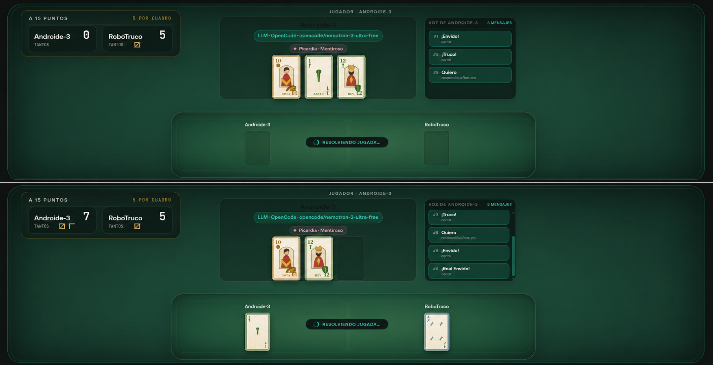
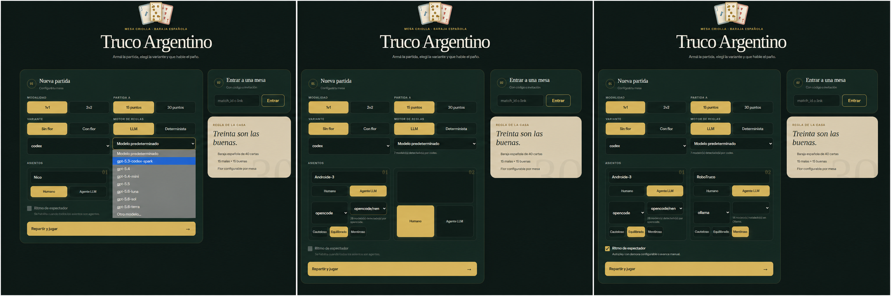
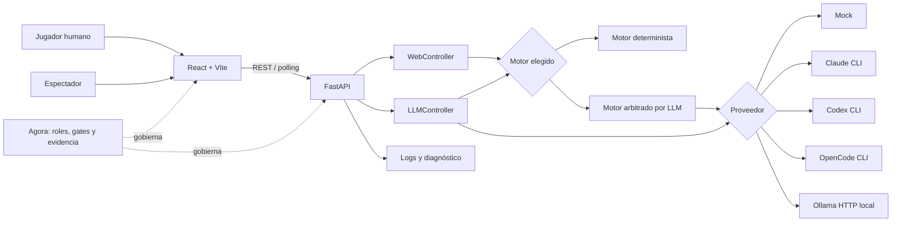
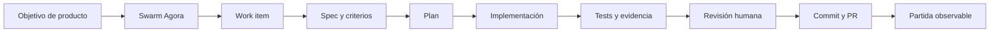
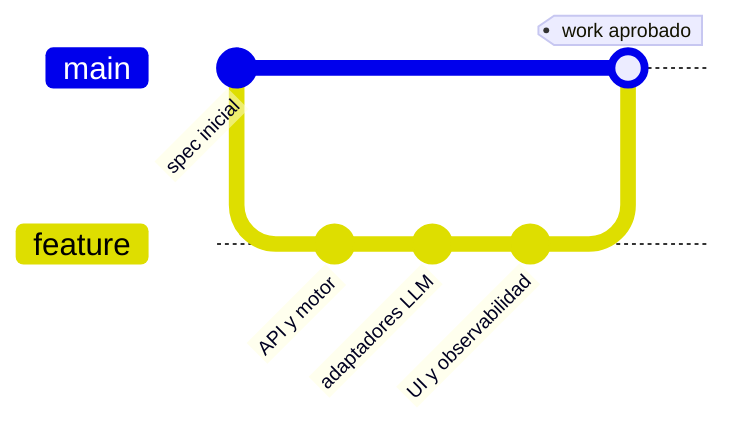
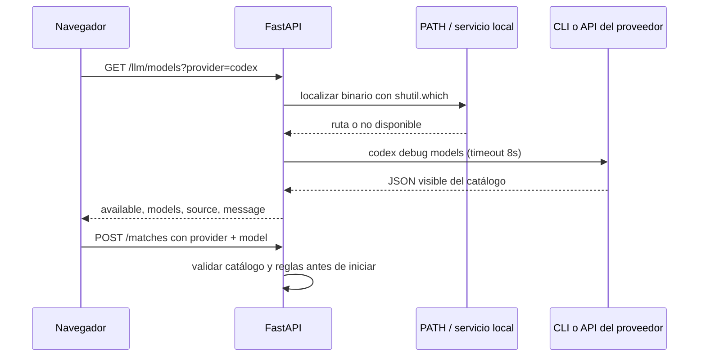
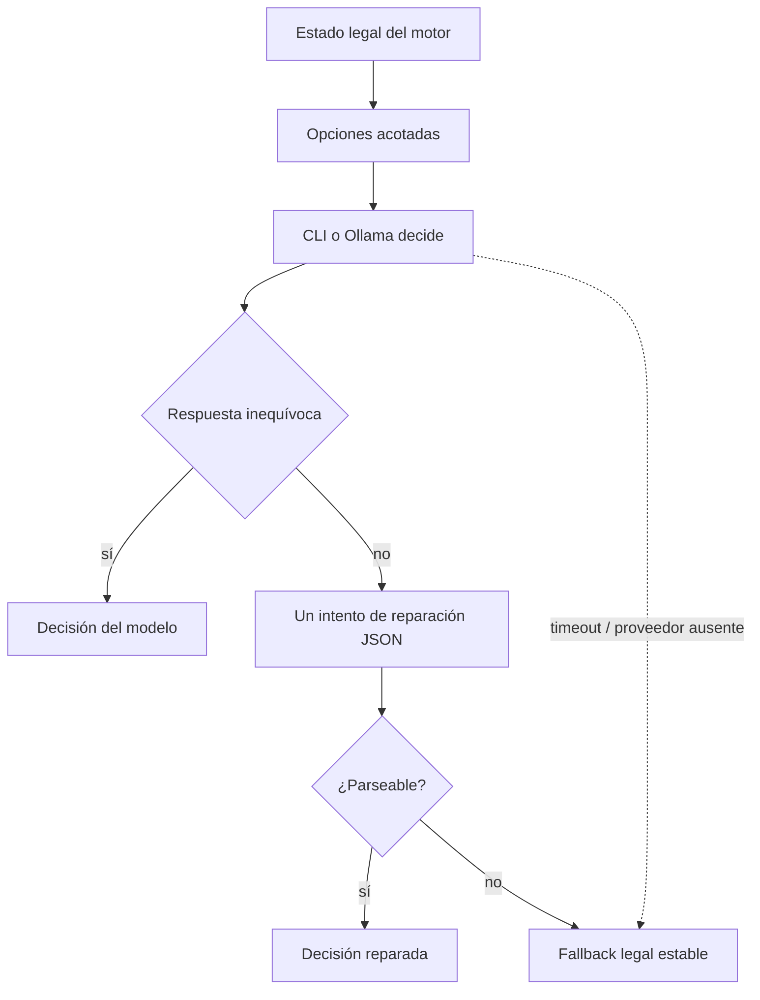
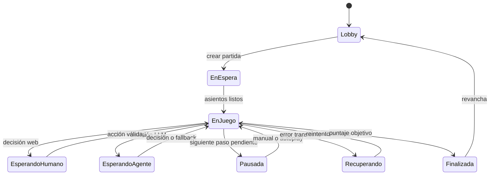
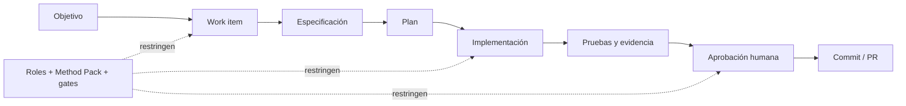

# Truco Agora

Truco Argentino jugable en modalidad **1v1 o 2v2**, con participantes humanos y
agentes LLM, una interfaz web para jugadores y espectadores, y un ciclo de
desarrollo gobernado y auditable con [Agora](https://github.com/Modern-Ash/agora).

El proyecto funciona tanto como juego como laboratorio: permite comparar
proveedores y modelos, observar cómo toman decisiones los agentes y conservar en
Git las especificaciones, evidencias y aprobaciones que dieron forma a cada
feature.

<p align="center">
  
</p>

<p align="center"><sub>Una arena observable: identidad del agente, estrategia, conversación, cartas y marcador evolucionan en una misma vista.</sub></p>

> [!IMPORTANT]
> El motor LLM es experimental: un modelo puede interpretar incorrectamente una
> regla fija. Para partidas reproducibles o validación funcional use el motor
> `deterministic`. La decisión y sus mitigaciones están documentadas en
> [docs/llm-engine.md](docs/llm-engine.md).

## Qué incluye

| Área | Capacidades |
|---|---|
| Juego | Mazo español de 40 cartas, 1v1 y 2v2, partidas a 15 o 30 puntos, Envido, Real Envido, Falta Envido, Truco, Retruco, Vale Cuatro, Flor opcional, pardas, mazo y cartas tapadas |
| Participantes | Asientos humanos o agentes, nombres automáticos, equipos configurables y niveles de picardía `cauteloso`, `equilibrado` o `mentiroso` |
| LLM | Claude CLI, Codex CLI, OpenCode CLI, Ollama local y proveedor `mock` determinista para desarrollo y CI |
| Experiencia web | Lobby, selección de motores/modelos, mesa responsiva, marcador de cerillos, señas 2v2, sonido, invitaciones y recuperación de sesión |
| Espectador | Partidas 100% LLM, avance manual o automático, manos visibles de los agentes y trazabilidad de cantos y jugadas |
| Backend | API FastAPI por turnos, sesiones en memoria, validación centralizada y diagnóstico vivo por partida |
| Observabilidad | Logs estructurados, correlación por `X-Request-ID`, archivo rotativo y eventos de sesión, motor, proveedor y controladores sin registrar prompts ni credenciales |
| Gobernanza | Swarms, work items, criterios, artefactos, evidencia y aprobaciones persistidos bajo `.agora/` |

## Qué demuestra este repositorio

Truco Agora es una demo ejecutable de un principio sencillo: un LLM puede
participar en un proceso tradicional de software sin convertirse en una caja
negra ni en la autoridad de las reglas. El dominio del juego funciona como un
proyecto pequeño pero real, con una especificación, decisiones de diseño,
implementación, pruebas y revisión humana.

La misma corrida puede observarse desde tres ángulos:

1. **Producto:** una partida de Truco con jugadores humanos, agentes o una
   combinación de ambos.
2. **Runtime:** el modelo, proveedor, decisión, tiempo de respuesta y fallback
   visible para cada agente.
3. **Proceso:** el work item de Agora, sus criterios, artefactos, sesiones,
   evidencia, aprobaciones y commits.

Esto permite enseñar la metodología con una aplicación que se puede iniciar en
local, inspeccionar con una API y reproducir en CI usando el proveedor `mock`.

## Recorrido visual

<p align="center">
  
</p>

La configuración crece de forma progresiva sin exigir archivos manuales:

1. Se eligen modalidad, puntaje, variante y motor de reglas.
2. El backend descubre los proveedores y modelos disponibles en la máquina.
3. Cada asiento puede ser humano o agente y tener proveedor, modelo y picardía propios.
4. Cuando todos los asientos son agentes se habilita el ritmo de espectador.

## Arquitectura



Las reglas legales se validan en el backend. Un agente jugador recibe únicamente
el estado visible y elige entre opciones permitidas; no puede inventar una carta
o una acción ilegal. El **motor** se configura por separado como determinista o
como árbitro LLM experimental.

## Requisitos

- Python 3.11 o posterior.
- Node.js 20 o posterior y npm.
- Git.
- Opcional: al menos uno de `claude`, `codex`, `opencode` u
  [Ollama](https://ollama.com/) para usar modelos reales. El modo `mock` no
  necesita credenciales ni servicios externos.
- Opcional: Agora CLI para inspeccionar y continuar el ciclo gobernado.

Para instalar el CLI de Agora de forma aislada (sin agregarlo a las
dependencias del juego):

```bash
uv tool install --force agora-framework
agora doctor
```

El CLI se ejecuta desde la raíz del repositorio y detecta el `.agora/` local.
Si se trabaja con una copia existente, `agora doctor` confirma la rama, el
Method Pack, el runtime configurado y que los registros generados se pueden
seguir en Git.

## Inicio rápido

```bash
git clone https://github.com/Modern-Ash/truco-agora.git
cd truco-agora

python3 -m venv .venv
source .venv/bin/activate
python -m pip install --upgrade pip
python -m pip install fastapi uvicorn pydantic pytest httpx

cd webapp
npm install
npm run dev
```

`npm run dev` inicia el backend en `http://127.0.0.1:8000` y Vite en la URL
que informa la terminal, normalmente `http://localhost:5173`. Ambos procesos se
ven en la misma consola con los prefijos `[api]` y `[web]`. Deténgalos con
`Ctrl+C`.

### Demo reproducible de la metodología

Después de iniciar la aplicación, abre la URL de Vite y sigue este recorrido:



El repositorio ya conserva ejemplos de todas estas fases en `.agora/`. Para
inspeccionar el estado desde la raíz:

```bash
# Requiere tener instalado el CLI de Agora.
agora doctor                         # preflight del proyecto y herramientas
agora status                         # resumen del proyecto y atención pendiente
agora next                           # siguiente transición y actor responsable
agora activity list --limit 20      # ledger cronológico de eventos
agora validate                       # integridad de los registros persistidos
```

Para reproducir una nueva feature con el mismo método `spec-driven`, el flujo
mínimo es:

```bash
agora swarm create \
  --id truco-demo-feature \
  --objective "Add an observable, tested Truco feature" \
  --method spec-driven

agora swarm assign --swarm truco-demo-feature \
  --role spec-owner --actor project:owner
agora swarm assign --swarm truco-demo-feature \
  --role developer --actor project:agent

agora work create \
  --swarm truco-demo-feature \
  --id feature-work \
  --title "Implement the feature" \
  --description "Deliver the feature without bypassing the game engine" \
  --by project:owner \
  --criterion "behavior:The feature has an observable behavior" \
  --criterion "safety:Existing legal actions remain enforced" \
  --criterion "tests:Automated tests cover success and failure paths" \
  --required-artifact spec \
  --required-artifact implementation-plan \
  --required-artifact verification-report

agora next --swarm truco-demo-feature
agora run --actor project:owner --swarm truco-demo-feature --work feature-work
agora next --swarm truco-demo-feature
agora run --actor project:agent --swarm truco-demo-feature --work feature-work
agora activity list --swarm truco-demo-feature --work feature-work --limit 50
```

Cada `agora run` prepara una sesión gobernada para el actor asignado. El agente
recibe el contexto operativo desde Agora, actúa sólo dentro de las capacidades
de su rol y deja el resultado durable en `.agora/sessions/`. `agora next` es la
fuente de verdad para saber qué paso corresponde: si falta una spec, una
aprobación o evidencia, el comando lo muestra como bloqueo en vez de saltarlo.

El cierre de un work requiere evidencia y revisión explícita:

```bash
agora approval add \
  --swarm truco-demo-feature \
  --work feature-work \
  --role spec-owner \
  --by project:owner \
  --note "Reviewed behavior, evidence and regression results"

agora work transition \
  --swarm truco-demo-feature \
  --work feature-work \
  --to completed \
  --by project:owner

agora validate
```

El objetivo no es agregar burocracia a una partida: es hacer visible qué hizo
el agente, qué quedó registrado y qué decisión sigue necesitando una persona.

### Qué se construyó con ese proceso

El historial de `.agora/swarms/` muestra una evolución incremental, no un único
commit grande. Algunos work items completados que se pueden inspeccionar son:

| Work / swarm | Resultado observable |
|---|---|
| `truco-agora` | Motor inicial, reglas de Truco, CLI y primera demo gobernada |
| `truco-api` | API FastAPI stateful para crear partidas, consultar snapshots y enviar acciones |
| `truco-webapp` y `truco-config-ui` | Lobby, mesa de juego, espectadores y configuración de asientos |
| `truco-llm-providers` | Adaptadores pluggables para Claude, Codex, OpenCode, Ollama y `mock` |
| `truco-llm-engine` | Motor LLM experimental aislado del motor determinista de reglas |
| `004-truco-llm-autoplay` y `truco-step-mode` | Avance manual, autoplay y recuperación del flujo de espectador |
| `033-truco-backend-observability` y `035-truco-unified-dev-logs` | Eventos estructurados, correlación por request y logs visibles en `npm run dev` |
| `030-truco-opencode-live-models` y `017-truco-cli-catalog-fallback` | Catálogos locales y fallback de configuración cuando un CLI no responde |

Cada carpeta contiene el registro del swarm, sus interacciones, artefactos,
evidencia y eventos. Así, una persona puede pasar del README a un work item
concreto y comprobar cómo una decisión de diseño terminó en código y pruebas.



> [!NOTE]
> El supervisor espera el entorno virtual en `.venv/`. Si el puerto 8000 ya
> está ocupado por otro backend, se detiene con un mensaje explícito para no
> ocultar sus logs.

### Ejecutar cada capa por separado

```bash
# Terminal 1, desde la raíz
source .venv/bin/activate
python -m uvicorn truco.api:app --reload --host 127.0.0.1 --port 8000

# Terminal 2, desde webapp/
npm run dev:web
```

También puede usar `npm run dev:api` desde `webapp/` para iniciar solamente la
API con logging de depuración.

## Configuración LLM

Cada asiento agente define su propio `provider` y `model`. El motor de reglas
usa `engine`, `engine_provider` y `engine_model`, de forma independiente.

| Proveedor | Requisito | Ejemplo de modelo |
|---|---|---|
| `mock` | Ninguno | No aplica; respuesta determinista |
| `claude` | CLI `claude` autenticado | `sonnet`, `opus`, `haiku` o un id manual |
| `codex` | CLI `codex` autenticado | Modelo disponible en la configuración local |
| `opencode` | CLI `opencode` configurado | Modelo reportado por el CLI |
| `ollama` | Servicio local en `localhost:11434` | Un tag instalado, por ejemplo `llama3` |

Para Ollama:

```bash
ollama serve
ollama pull llama3
```

### Cómo se descubren los proveedores y modelos

El descubrimiento ocurre **en la máquina donde corre FastAPI**, no en el
navegador. Al montar el lobby, la UI consulta una vez cada proveedor disponible
y conserva el catálogo recibido para los selectores de motor y de asiento.
El endpoint es:

```http
GET /llm/models?provider=codex
```

Respuesta típica (el catálogo depende de la instalación local):

```json
{
  "provider": "codex",
  "available": true,
  "models": ["gpt-5.5", "gpt-5.6-sol"],
  "source": "cli",
  "allow_custom_model": true,
  "message": "2 modelo(s) detectado(s) por codex."
}
```

El backend aplica un timeout de descubrimiento de ocho segundos, no imprime
credenciales y registra sólo metadatos seguros (`provider`, `source`, cantidad
de modelos y duración). El algoritmo por proveedor es deliberadamente
explícito:

| Proveedor | Comprobación local | Catálogo | Qué ve el usuario si falla |
|---|---|---|---|
| `mock` | Integrado, sin proceso externo | Ningún modelo; decisiones deterministas | Siempre disponible para tests y CI |
| `claude` | `shutil.which("claude")` | Aliases estables `sonnet`, `opus`, `haiku`, `fable`; admite id manual | Se informa que el CLI no está en `PATH`; no se inventa disponibilidad de ejecución |
| `codex` | `shutil.which("codex")` | Ejecuta `codex debug models`, lee JSON y descarta modelos ocultos | Catálogo vacío o diagnóstico seguro; se puede escribir un id manual |
| `opencode` | `shutil.which("opencode")` | Ejecuta `opencode models --pure` y acepta líneas `provider/model` | Diagnóstico seguro; se habilita un identificador manual si no hay catálogo |
| `ollama` | Consulta `http://localhost:11434/api/tags` | Tags instalados devueltos por el servicio local | El selector queda bloqueado hasta iniciar Ollama y tener al menos un tag |

Puedes comprobar exactamente la misma superficie desde una terminal (en el
mismo entorno desde el que arrancaste la API):

```bash
command -v claude   # ruta del CLI, si está instalado
command -v codex
command -v opencode

codex debug models              # catálogo JSON que consume Agora
opencode models --pure          # líneas provider/model que consume Agora
curl -sS http://localhost:11434/api/tags  # tags locales de Ollama

curl -sS 'http://127.0.0.1:8000/llm/models?provider=codex' | python -m json.tool
```

`command -v` y los comandos de catálogo sólo verifican disponibilidad y
modelos visibles; no leen archivos de credenciales. La autenticación sigue
siendo responsabilidad del CLI o servicio que el desarrollador ya usa.

El flujo completo es:



Hay dos diferencias importantes entre proveedores:

- Claude Code no ofrece un listado estable de modelos para este adaptador. Por
  eso se comprueba el binario y se publican aliases conocidos, manteniendo un
  campo manual para un nombre completo.
- Ollama sí expone los modelos instalados. Truco Agora vuelve a comprobar ese
  catálogo al crear la partida y rechaza un tag ausente, un servicio apagado o
  un modelo vacío antes de iniciar el hilo de juego.

Si la consulta del catálogo falla, la UI puede mostrar opciones conocidas para
no romper la configuración, pero la creación y la ejecución siguen dependiendo
de que el proveedor real esté instalado y autenticado. Esta separación evita
confundir una sugerencia visual con una capacidad realmente disponible.

### Decisiones, parseo y fallback

La UI sólo selecciona proveedor y modelo. El backend construye un prompt con
las opciones legales que ya produjo el motor y los adaptadores piden una única
opción. Si la respuesta contiene ANSI, `<think>`, JSON o texto adicional, se
normaliza y se intenta reparar una vez con `{"choice":"OPCION"}`. Si continúa
siendo ambigua, hay timeout o el proceso no existe, se aplica un fallback legal
reproducible mediante hash estable del contexto y de las opciones ordenadas.



La mesa identifica la procedencia como `model`, `repaired` o `fallback`, junto
con un motivo público como `provider-timeout`, `provider-unavailable` o
`invalid-response`. Nunca expone prompts, respuestas privadas, claves ni el
razonamiento interno del proveedor. El motor determinista sigue siendo la
referencia para validar reglas y para pruebas reproducibles.

La CLI acepta valores globales por argumento o entorno:

```bash
TRUCO_ENGINE=deterministic \
TRUCO_LLM_PROVIDER=mock \
python -m truco.cli --mode 1v1 --target 15
```

```bash
python -m truco.cli \
  --mode 2v2 \
  --target 30 \
  --engine llm \
  --llm-provider ollama \
  --llm-model llama3
```

## Modos de juego

### Humanos y agentes

El lobby permite combinar asientos humanos y agénticos. Los equipos alternan
por posición: los asientos pares pertenecen al primer equipo y los impares al
segundo. En 2v2 se habilitan las señas efímeras entre compañeros.

### Arena de agentes

Cuando todos los asientos son agentes puede activarse el modo espectador paso a
paso. El espectador no ocupa un asiento y puede:

- avanzar una decisión por vez;
- activar autoplay y controlar su velocidad;
- ver las manos de los agentes;
- seguir el agente, proveedor y modelo reales de cada asiento;
- inspeccionar cantos, respuestas, cartas y evolución del marcador.

### Caso observado: cuando dos agentes pueden farolear

Una corrida experimental terminó **13 a 5**. Los dos jugadores usaron la misma
picardía, `mentiroso`, pero no con el mismo resultado:

| Asiento | Runtime y modelo | Picardía |
|---|---|---|
| Androide-3 | OpenCode con `mimo-v2.5-free` | Mentiroso |
| Bot Basto | Ollama con `deepseek-r1:1.5b` | Mentiroso |

Las capturas de esta portada ilustran otra corrida de la misma clase de
experimento —Androide-3 frente a RoboTruco— y no se presentan como evidencia
visual del resultado final 13–5.

La diferencia no apareció solamente en las cartas. Se hizo visible al decidir
cuándo cantar Envido, aceptar un Truco, escalar a Real Envido o sostener una
amenaza con una mano débil. El perfil de picardía define una **intención
estratégica**, pero cada modelo la interpreta de manera distinta.

- `cauteloso`: farolea solo en situaciones puntuales;
- `equilibrado`: combina evidencia, presión y engaño;
- `mentiroso`: farolea con mayor frecuencia y acepta más riesgo.

Esto no habilita al agente a cambiar las reglas. En una evaluación con motor
determinista, el LLM elige la estrategia entre acciones legales y el motor
calcula tantos, valida cartas, controla cantos y resuelve bazas. El agente puede
mentir sobre la fuerza que aparenta tener; no puede falsificar el valor real de
su Envido.

> [!NOTE]
> Una partida 13–5 no permite declarar un modelo universalmente superior. Es una
> observación que propone una hipótesis. Un benchmark serio necesita múltiples
> partidas, semillas controladas y métricas sobre faroles, escaladas, retiros,
> riesgo asumido y puntos obtenidos.

El historial visible convierte cada canto en parte del estado observable. Es
posible reconstruir quién dijo `Envido`, `Quiero`, `Truco`, `Real Envido` o
`No quiero`, relacionarlo con el marcador y distinguir estilos como:

- faroles previsibles o patrones repetidos;
- apuestas que ignoran el marcador;
- riesgo ajustado a ser mano o pie;
- presión sostenida frente al historial del rival;
- capacidad de abandonar un engaño a tiempo.

Así, Truco Agora permite evaluar algo diferente de la exactitud textual: cómo un
agente persuade, presiona, desconfía y engaña dentro de un entorno controlado.



## API

FastAPI publica documentación interactiva en
`http://127.0.0.1:8000/docs` mientras el backend está activo.

| Método | Ruta | Propósito |
|---|---|---|
| `GET` | `/llm/models?provider=...` | Descubrir disponibilidad y modelos del proveedor |
| `POST` | `/matches` | Crear una partida 1v1 o 2v2 |
| `GET` | `/matches/{id}/state` | Obtener el estado visible de un jugador o espectador |
| `POST` | `/matches/{id}/actions` | Jugar una carta, cantar, responder o irse al mazo |
| `POST` | `/matches/{id}/step` | Liberar la siguiente decisión en modo paso a paso |
| `POST` | `/matches/{id}/senas` | Enviar una seña al compañero en 2v2 |
| `GET` | `/matches/{id}/diagnostics` | Consultar progreso y bloqueos sin revelar datos privados |

Ejemplo mínimo con dos agentes mock y motor determinista:

```bash
curl -sS -X POST http://127.0.0.1:8000/matches \
  -H 'Content-Type: application/json' \
  -d '{
    "mode": "1v1",
    "target_score": 15,
    "engine": "deterministic",
    "players": [
      {"name": "La Táctica", "kind": "agent", "provider": "mock"},
      {"name": "El Farol", "kind": "agent", "provider": "mock"}
    ],
    "step_mode": true
  }'
```

El contrato completo y los códigos de error están en
[docs/api-spec.md](docs/api-spec.md).

## Observabilidad

La API emite eventos estructurados para requests, sesiones, manos, fases,
decisiones, proveedores, fallbacks y recuperación. No registra prompts,
credenciales, cuerpos HTTP ni cartas privadas.

Los polls exitosos de `/state` se deduplican y el access log redundante de
Uvicorn está desactivado en desarrollo. Los cambios de snapshot, requests
lentos y errores siguen quedando registrados con `X-Request-ID`.

| Variable | Default | Descripción |
|---|---|---|
| `TRUCO_LOG_LEVEL` | `DEBUG` | `DEBUG`, `INFO`, `WARNING` o `ERROR` |
| `TRUCO_LOG_FILE` | `logs/truco-backend-debug.log` | Archivo rotativo de 5 MiB y tres respaldos; vacío lo desactiva |
| `TRUCO_API_TARGET` | `http://127.0.0.1:8000` | Backend usado por el supervisor y el proxy de Vite |

```bash
TRUCO_LOG_LEVEL=INFO \
TRUCO_LOG_FILE=./logs/truco.log \
cd webapp && npm run dev
```

Cada respuesta HTTP incluye `X-Request-ID`; también puede enviarlo el cliente
para correlacionar su request con los logs. Para investigar una espera:

```bash
curl -sS http://127.0.0.1:8000/matches/MATCH_ID/diagnostics
tail -f logs/truco-backend-debug.log
```

Más detalles: [especificación](docs/backend-observability-spec.md) e
[informe de verificación](docs/backend-observability-test-report.md).

## Pruebas y calidad

```bash
# Backend
source .venv/bin/activate
python -m pytest -q

# Frontend
cd webapp
npm test
npm run lint
npm run build

# Integración real Vite + Uvicorn
npm run e2e
```

La suite no requiere un proveedor LLM real: los adaptadores y decisiones se
prueban con dobles controlados. `npm run e2e` sí abre un puerto local temporal
y recorre una partida completa contra Uvicorn.

## Desarrollo gobernado con Agora

El directorio `.agora/` no es documentación decorativa: contiene el estado
operativo y auditable del ciclo de desarrollo. Allí viven actores humanos y AI,
Method Packs, swarms, work items, handoffs, criterios, artefactos, evidencia y
aprobaciones.



Con Agora instalado, desde la raíz:

```bash
agora doctor
agora status
agora next
agora validate
```

- `status` resume el estado del proyecto y los trabajos que requieren atención.
- `next` muestra la próxima acción permitida y el actor responsable.
- `validate` comprueba la consistencia de los registros persistidos.
- Los commits deben seguir [Conventional Commits](https://www.conventionalcommits.org/).

## Estructura del repositorio

```text
.
├── .agora/             Estado gobernado: actores, swarms, work y evidencia
├── docs/               Especificaciones y reportes de verificación
├── truco/              Dominio, motores, controladores, API y proveedores LLM
│   └── tests/          Tests del backend y las reglas
├── webapp/             React, Vite, Tailwind y pruebas de interfaz
│   ├── src/
│   └── tests/
├── spec.md             Especificación base del motor
└── test-report.txt     Evidencia histórica de la suite inicial
```

## Documentación técnica

- [Reglas completas v2](docs/reglas-v2.md)
- [API REST](docs/api-spec.md)
- [Webapp](docs/webapp-spec.md)
- [Motor arbitrado por LLM](docs/llm-engine.md)
- [Proveedores LLM](docs/llm-providers.md)
- [Autoplay de agentes](docs/llm-autoplay.md)
- [Modo espectador paso a paso](docs/step-mode.md)
- [Configuración de proveedores en la UI](docs/config-ui.md)
- [Observabilidad del backend](docs/backend-observability-spec.md)
- [Diseño visual](webapp/DESIGN.md)

## Límites actuales

- Las sesiones de partida viven en memoria y se pierden al reiniciar el backend.
- No hay autenticación de jugadores ni persistencia de usuarios.
- La sincronización web usa polling; no hay WebSocket ni SSE.
- El arbitraje LLM puede producir decisiones incorrectas aunque la respuesta sea
  sintácticamente válida. Use el motor determinista como referencia.
- Los CLIs de proveedores deben estar instalados y autenticados por fuera del
  proyecto; Truco Agora no almacena sus credenciales.

## Fuente del reglamento

La especificación base partió del
[reglamento de Truco Argentino](https://trucogame.com/pages/reglamento-de-truco-argentino)
y las ampliaciones v2 contrastan variantes oficiales citadas en
[docs/reglas-v2.md](docs/reglas-v2.md).
